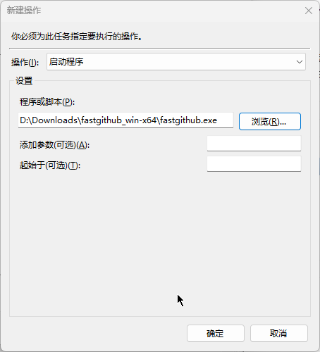
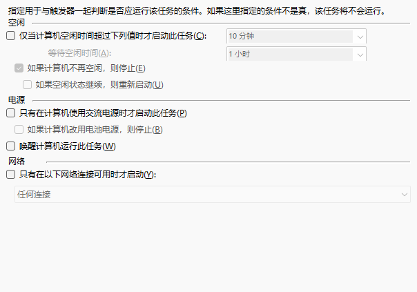

# Fastgihub auto start

Sometimes, we could not access to github.com, and watt-toolkit is a very great tool, which is also named as steam++. However the software will make some trouble to git push to the github with ssh key. If you do not have other network accelerate demand, fastgithub is a good choice.

## Install

If you are able to access to github.com, you may install in [here](https://github.com/WangGithubUser/FastGithub/releases).
Vice versa, you could follow [gitee](https://gitee.com/XingYuan55/FastGithub)(it wasn't an official website), or search on the browser by yourself better.

## Auto start

1. right click on the "this computer" and click on the manager.![[mmc_NUMzLOFEXb.png]] 
2. right click on the "tasks schedule library" in the "task schedule programme" in the "system tools", then click "create tasks"![[mmc_hc8evz3XKX.png]]
3. name "fastgithub" or any other name as you like.![[mmc_WToyVFymYB.png]]
4. turn into the "trigger", click on the "create", then set as the picture.
5. then turn into the "control", click on the "create", then choose the path where you install the fastgithub.exe
   ![[mmc_ah7gDUFY7m.png]]
6. in the "condition", set the same as the picture.![[mmc_jtAlRQy98K.png]]
7. in the "setting", set the same as the picture.![[mmc_upPBLMuqe0.png]]
8. finally click the "ensure" one by one. When the system ask for password, input the password of you computer, instead of pin.
